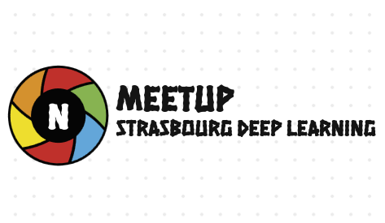

# Strasbourg Deep Learning Meetup
## Intro

**Strasbourg Deep Learning Meetup**

This is a group for anyone interested in deep learning algorithms. We're trying to create a community so that sharing knowledge and passion for deep learning is possible.

If you want to attend our meetups, please sign up [here](https://www.meetup.com/strasbourg-deep-learning-meetup/).

## Links & Resources

* Meetup page: [link](https://www.meetup.com/strasbourg-deep-learning-meetup/)
* Facebook group: [link](https://www.facebook.com/groups/343110153013312)
* Team: Robert Maria ([email](mailto:maria11robert@gmail.com))

## Presentations

| Date       | Place | Speaker                   | Topic                                                                          | Slides                       |
|:----------:|:---:|:-------------------------:|:------------------------------------------------------------------------------:|:----------------------------:|
| 2024-01-20 |  Les Compotes Café | Mounir Bendali-Braham  | #M37: "Annotation d'images avec l'Intelligence Artificielle" | [pdf](./Meetups/M37/Image_captioning.pdf) |
| 2023-12-02 |  La Plage Digitale | François Weber  | #M36: "Comment fonctionne un moteur de recherche web ? Un bon cas d'utilisation pour le learning to rank" | [pdf](./Meetups/M36/meetup_2023_LTR2.pdf) |
| 2023-11-11 |  La Plage Digitale | Laurence Jennings  | #M35: Automatiser les tâches LLM avec Langchain et GPT | [code](./Meetups/M35/langchain_web_scraper.ipynb) |
| 2023-10-14 |  La Plage Digitale | Robert Maria  | #M34: Comment analyser des documents textuels avec OpenAI GPT | [code](./Meetups/M34/scrape_analyze_news_websites.js) |
| 2023-07-22 |  La Plage Digitale | Robert Maria et Mounir Bendali-Braham | #M33: Introduction à la rétropropagation p.2 |  |
| 2023-06-17 |  Les Compotes Café | Robert Maria et Mounir Bendali-Braham | #M32: Introduction à la rétropropagation et à la descente de gradient stochastique |  |
| 2023-05-13 |  La Plage Digitale | Robert Maria | #M31: Écrire votre premier modèle deep learning pour classifier les chiens, les chats | [code](./Meetups/M31/classifier_dogs_cats.ipynb) |
| 2023-04-15 |  Les Compotes Café | Robert Maria | #M30: Introduction à l'intelligence artificielle et au deep learning | [pdf](./Meetups/M30/meetup_stras_introd.pdf) |
| 2021-06-01 |  online | Vinkle Kumar | #M29: Unsupervised Domain Adaptation Approaches for Person Localization in the operating room |  |
| 2021-09-23 |  online | Bogdan Burlacu |  #M28: Scientific Machine Learning |  |
| 2021-09-23 |  online | Patrick Hynds, Ciprian Jichici | #M27: An Introduction to Quantum Computing and Applied Learning |  |
| 2021-07-21 |  online | Dacian Stroia, Eitan Netzer, Alexandru Iliescu | #M26: Accelerating model retraining using coresets & Scoliosis X-ray analysis using DL |  |
| 2021-07-07 |  online | Iulia Duta, Andrei Nicolicioiu  | #M25: Introduction to Graph Neural Networks | [pdf](./Meetups/M25/Intro_to_Graph_Neural_Networks.pdf) |
| 2021-04-15 |  online | Andrei Hera  | #M24: Pie&AI - Retrieval-Augmented Generation for Knowledge-Intensive NLP Tasks |  |
| 2020-12-15 |  online | Bastiaan Veeling, Olivier Teytaud, Danielle S. Bassett  | #M23: NeurIPS meetup#2: Beyond Backprop-Novel Ideas for Training Neural Architectures |  |
| 2020-12-11 |  online | Thibaud Rahier, Laurent Meunier | #M22: Les Déjeuners NeurIPS #5: Analog Adversarial Robustness and Optimization |  |
| 2020-12-10 |  online | NeurIPS presenters | #M21: NeurIPS meetup: Representation/Relational learning |  |
| 2020-12-10 |  online | Julien Launay, Tom Monnier | #M20: Les Déjeuners NeurIPS #4: Feedback Alignment, Deep Transformation & Clustering |  |
| 2020-12-09 |  online | Kimia Nadjahi, Etienne Perot, Vianney Perchet | #M19: Les Déjeuners NeurIPS #3: Wasserstein, Event Camera Learning, Bandits |  |
| 2020-12-08 |  online | Marine Le Morvan, Raphaël Berthier, Clément Calauzènes, Victor Sanh | #M18: Les Déjeuners de NeurIPS #2: Ranking, NeuMiss, SGD, Adaptive Sparsity |  |
| 2020-12-07 |  online | Matthieu Geist, Nino Vieillard, Ruben Ohana| #M17: Les Déjeuners de NeurIPS #1: Reinforcement Learning et Reservoir Computing |  |
| 2020-11-20 |  online | Sergio Garrido| #M16: Estimating causal effects using NADEs |  |
| 2020-11-05 |  online | Robert Maria, Titus Nicolae| #M15: Pie & AI: Strasbourg - Autoencoders and Variational Autoencoders | [pdf](./Meetups/M15/ae.pdf) |
| 2020-09-24 |  online | Robert Maria | #M14: Introduction to Deep Generative Models | [pdf](./Meetups/M14/introd_to_generative.pdf) |
| 2020-06-25 |  online | Claudiu Vintila| #M13: Pie & AI Strasbourg: Deploying your neural network in the cloud | [code](./Meetups/M13/) |
| 2020-05-29 |  online | Laurence Jennings| #M12: Natural Language Processing: from word embeddings to transformers | [pdf](./Meetups/M15/From_word_embeddings_to_transformers.pdf) |
| 2020-04-17 |  online | Vinkle Kumar | #M11: Visualization and understanding of deep neural networks | [pdf](./Meetups/M15/ae.pdf) |
| 2020-02-13 |  10 Rue de Châtenois | Robert Maria | #M10: Object detection with deep learning |  |
| 2020-01-15 |  19 Rue de Dunkerque | Markus Hartinger | #M9: Introduction to explainability in deep learning |  |
| 2019-12-12 |  online | Anna Goldenberg, Barbara Engelhardt | #M8: NeurIPS Tutorial: Machine Learning for Computational Biology and Health |  |
| 2019-11-21 |  19 Rue de Dunkerque | Robert Maria, Vinkle Kumar | #M7: Introduction to Deep Learning: SGD, RMSProp, ADAM |  |
| 2019-11-04 |  19 Rue de Dunkerque | Robert Maria | #M6: Introduction to Deep Learning: backprop, training, optimization |  |
| 2019-10-21 |  19 Rue de Dunkerque | Robert Maria | #M5: Introduction to Deep Learning |  |
| 2019-10-03 |  19 Rue de Dunkerque | Robert Maria | #M4: Classification with Convolutional Neural Networks (Keras and Pytorch style) |  |
| 2019-07-29 |  La Fabrique | Robert Maria | #M3: Classification with Convolutional Neural Networks |  |
| 2019-06-20 |  La Fabrique | Robert Maria | #M2: Coding session: train a classifier for classification |  |
| 2019-05-29 |  Le Galopin | Beer | #M1: Get to know each other / Faisons connaissance |  |
